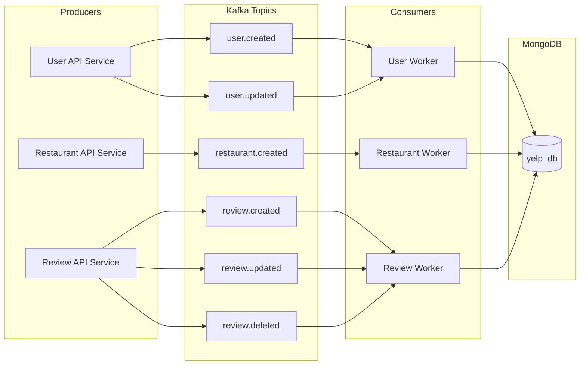

# Yelp Clone — Lab 1 & Lab 2

A Yelp-style restaurant discovery and review platform with a React UI, FastAPI backends, and an AI assistant (LangChain, Groq, Tavily).

| Track | Backend | Database | How you run it |
|-------|---------|----------|----------------|
| **Lab 1** | `yelp_backend/` (monolith) | MySQL | Uvicorn + MySQL |
| **Lab 2** | `yelp_backend_v2/` (microservices) | MongoDB | Docker Compose + nginx gateway |

Use **Lab 2** for the distributed stack (Docker, Kafka, Mongo, Redux, AWS EKS). Use **Lab 1** only if you need the original MySQL monolith.

---

## Project structure

```
DATA_236_LAB1/
├── yelp_frontend/          # React UI with Redux state management
├── yelp_backend/           # Lab 1 — FastAPI + MySQL
├── yelp_backend_v2/        # Lab 2 — microservices, Docker, K8s manifests, Kafka workers
├          
└── README.md
```

---

## Lab 2 — Architecture

High-level view of the **Docker Compose** stack (Kubernetes is the same logical layout: Deployments + ClusterIP Services inside namespace `yelp-lab2`).



**Topics used by this repo** (see `yelp_backend_v2/k8s/kafka-topics-job.yaml`): `review.created`, `review.updated`, `review.deleted`, `restaurant.created`, `user.created`, `user.updated`.

---

## Lab 2 — Run the full stack (recommended)

### Prerequisites

- **Docker Desktop** running
- **Node.js 16+** and **npm**

### 1. Start backend, MongoDB, Kafka, workers, gateway

From the folder that contains `docker-compose.yml`:

```bash
cd yelp_backend_v2
docker compose -p yelpv2 up -d
```

Wait **30–60 seconds** after startup so Kafka and services that connect to it can become ready.

**Host ports (defaults):**

| Service | Port |
|---------|------|
| API gateway (nginx) | **18000** |
| User service | 18101 |
| Restaurant service | 18102 |
| Review service | 18103 |
| Owner service | 18104 |
| MongoDB | **37017** → container `27017` |
| Kafka (host) | 19092 |
| Zookeeper (host) | 12181 |

If `http://localhost:18000/restaurants/` returns **502** but `http://localhost:18102/restaurants/` returns **200**, wait for Kafka to settle, then run `docker restart yelp_gateway` so nginx picks up the current upstream IPs.

**Do not** run two processes on **18000** at once (Compose **nginx** `yelp_gateway` container vs **Node** `yelp_gateway/server.js`).

### 2. (Optional) Seed MongoDB

Requires `pymongo`, `passlib`, and `bcrypt==4.0.1` (use a venv if your system Python is PEP 668–managed):

```bash
cd yelp_backend_v2
MONGO_URL=mongodb://127.0.0.1:37017 MONGO_DB_NAME=yelp_db python seed.py
```

(`seed.py` defaults to `mongodb://localhost:37017` if `MONGO_URL` is unset.)

### 3. Start the frontend

```bash
cd yelp_frontend
npm install
npm start
```

Create **`yelp_frontend/.env`**:

```
REACT_APP_API_URL=http://localhost:18000
```

Restart `npm start` after changing `.env`.

- **App:** http://localhost:3000
- **Gateway health:** http://localhost:18000/

### 4. Swagger (OpenAPI) — Lab 2

The nginx gateway routes **API path prefixes**, not `/docs`. Open Swagger **per service**:

| Service | URL |
|---------|-----|
| User | http://localhost:18101/docs |
| Restaurant | http://localhost:18102/docs |
| Review | http://localhost:18103/docs |
| Owner | http://localhost:18104/docs |

---

## Redux — Frontend State Management

Redux Toolkit was integrated into the React frontend to manage global application state. The store is located in `yelp_frontend/src/store/`.

### Install dependencies

```bash
cd yelp_frontend
npm install @reduxjs/toolkit react-redux
```

### Store structure

```
yelp_frontend/src/
├── store/
│   ├── index.js                  # configureStore — combines all slices
│   └── slices/
│       ├── authSlice.js          # JWT token, role, user profile
│       └── restaurantSlice.js    # restaurant list, loading, filters
```

### Slices

| Slice | State managed | Key actions |
|-------|--------------|-------------|
| `authSlice` | JWT token, user role, user profile | `loginSuccess`, `logoutSuccess`, `setUser` |
| `restaurantSlice` | Restaurant list, loading, filters | `fetchRestaurants` (async thunk), `setFilters`, `clearFilters` |

### Usage

The `<Provider store={store}>` wraps the app in `src/index.js`. Components use:

```js
const { token, role } = useSelector(state => state.auth);
const { list, loading, filters } = useSelector(state => state.restaurants);
const dispatch = useDispatch();

dispatch(fetchRestaurants(filters));   // fetch from API
dispatch(loginSuccess({ token, role })); // on login
dispatch(logoutSuccess());              // on logout
```

### Redux DevTools

Install the [Redux DevTools Chrome extension](https://chrome.google.com/webstore/detail/redux-devtools/) to inspect state changes in the browser.

---

## Lab 2 — Kubernetes (local)

Requires a cluster (**Minikube**, Docker Desktop Kubernetes, or cloud) and `kubectl` configured.

```bash
cd yelp_backend_v2
kubectl apply -f k8s/namespace.yaml
kubectl apply -f k8s/
```

Create topics (see [`yelp_backend_v2/README.md`](yelp_backend_v2/README.md)), then use **`kubectl port-forward`** for services on the host.

---

## AWS EKS Deployment

The full backend stack was deployed to **Amazon EKS** (Elastic Kubernetes Service). All Docker images were built for `linux/amd64` and pushed to **Amazon ECR**.

### Prerequisites

- AWS CLI configured (`aws configure`)
- `eksctl` installed
- `kubectl` installed
- Docker Desktop running

### Step 1 — Create EKS cluster

```bash
eksctl create cluster \
  --name yelp-cluster \
  --region us-east-1 \
  --nodegroup-name yelp-nodes \
  --node-type t3.small \
  --nodes 3 \
  --nodes-min 3 \
  --nodes-max 4 \
  --managed \
  --timeout 40m
```


### Step 2 — Create ECR repositories

```bash
REGION=us-east-1
aws ecr create-repository --repository-name yelp/user_service      --region $REGION
aws ecr create-repository --repository-name yelp/restaurant_service --region $REGION
aws ecr create-repository --repository-name yelp/review_service     --region $REGION
aws ecr create-repository --repository-name yelp/owner_service      --region $REGION
aws ecr create-repository --repository-name yelp/user-worker        --region $REGION
aws ecr create-repository --repository-name yelp/restaurant-worker  --region $REGION
aws ecr create-repository --repository-name yelp/review-worker      --region $REGION
```

### Step 3 — Build and push images (linux/amd64)

```bash
ACCOUNT_ID=$(aws sts get-caller-identity --query Account --output text)
REGION=us-east-1
ECR=$ACCOUNT_ID.dkr.ecr.$REGION.amazonaws.com

aws ecr get-login-password --region $REGION | docker login --username AWS --password-stdin $ECR

cd yelp_backend_v2

docker buildx build --platform linux/amd64 -t $ECR/yelp/user_service:latest      ./user_service       --push
docker buildx build --platform linux/amd64 -t $ECR/yelp/restaurant_service:latest ./restaurant_service --push
docker buildx build --platform linux/amd64 -t $ECR/yelp/review_service:latest    ./review_service     --push
docker buildx build --platform linux/amd64 -t $ECR/yelp/owner_service:latest     ./owner_service      --push
docker buildx build --platform linux/amd64 -t $ECR/yelp/user-worker:latest       ./user_worker_service       --push
docker buildx build --platform linux/amd64 -t $ECR/yelp/restaurant-worker:latest ./restaurant_worker_service --push
docker buildx build --platform linux/amd64 -t $ECR/yelp/review-worker:latest     ./review_worker_service     --push
```

> **Important:** Always use `--platform linux/amd64` when building on Apple Silicon (M1/M2) Macs.

### Step 4 — Update k8s image URLs

```bash
ACCOUNT_ID=$(aws sts get-caller-identity --query Account --output text)
REGION=us-east-1
ECR=$ACCOUNT_ID.dkr.ecr.$REGION.amazonaws.com

sed -i '' "s|yelp_backend_v2-user_service:kafka2|$ECR/yelp/user_service:latest|g"               k8s/user-service-deployment.yaml
sed -i '' "s|yelp_backend_v2-restaurant_service:kafka1|$ECR/yelp/restaurant_service:latest|g"   k8s/restaurant-service-deployment.yaml
sed -i '' "s|yelp_backend_v2-review_service:kafka1|$ECR/yelp/review_service:latest|g"           k8s/review-service-deployment.yaml
sed -i '' "s|yelp_backend_v2-owner_service:latest|$ECR/yelp/owner_service:latest|g"             k8s/owner-service-deployment.yaml
sed -i '' "s|yelp_backend_v2-user_worker_service:kafka1|$ECR/yelp/user-worker:latest|g"         k8s/user-worker-deployment.yaml
sed -i '' "s|yelp_backend_v2-restaurant_worker_service:kafka1|$ECR/yelp/restaurant-worker:latest|g" k8s/restaurant-worker-deployment.yaml
sed -i '' "s|yelp_backend_v2-review_worker_service:kafka1|$ECR/yelp/review-worker:latest|g"     k8s/review-worker-deployment.yaml
```

### Step 5 — Fix ECR pull permissions

```bash
NODE_ROLE=$(aws eks describe-nodegroup \
  --cluster-name yelp-cluster \
  --nodegroup-name yelp-nodes \
  --region us-east-1 \
  --query 'nodegroup.nodeRole' --output text | awk -F'/' '{print $NF}')

aws iam attach-role-policy \
  --role-name $NODE_ROLE \
  --policy-arn arn:aws:iam::aws:policy/AmazonEC2ContainerRegistryReadOnly
```

### Step 6 — Deploy to EKS

```bash
# Update kubeconfig
aws eks update-kubeconfig --region us-east-1 --name yelp-cluster

# Enable prefix delegation (fixes IP exhaustion on t3.small)
kubectl set env daemonset aws-node -n kube-system ENABLE_PREFIX_DELEGATION=true
kubectl rollout restart daemonset aws-node -n kube-system
sleep 30

# Deploy all services
kubectl apply -f k8s/namespace.yaml
kubectl apply -f k8s/mongodb-pvc.yaml
kubectl apply -f k8s/configmap.yaml
kubectl apply -f k8s/secret.yaml
kubectl apply -f k8s/mongodb-deployment.yaml
kubectl apply -f k8s/mongodb-service.yaml
kubectl apply -f k8s/zookeeper-deployment.yaml
kubectl apply -f k8s/zookeeper-service.yaml
kubectl apply -f k8s/kafka-deployment.yaml
kubectl apply -f k8s/kafka-service.yaml
sleep 90
kubectl apply -f k8s/kafka-topics-job.yaml
sleep 20
kubectl apply -f k8s/user-service-deployment.yaml
kubectl apply -f k8s/user-service.yaml
kubectl apply -f k8s/restaurant-service-deployment.yaml
kubectl apply -f k8s/restaurant-service.yaml
kubectl apply -f k8s/review-service-deployment.yaml
kubectl apply -f k8s/review-service.yaml
kubectl apply -f k8s/owner-service-deployment.yaml
kubectl apply -f k8s/owner-service.yaml
kubectl apply -f k8s/user-worker-deployment.yaml
kubectl apply -f k8s/restaurant-worker-deployment.yaml
kubectl apply -f k8s/review-worker-deployment.yaml
```

### Step 7 — Verify

```bash
kubectl get pods -n yelp-lab2       # all should show Running
kubectl get services -n yelp-lab2   # all ClusterIP services
kubectl get nodes                    # 3 nodes Ready
```

### Step 8 — Access services via port-forward

Run each in a separate terminal tab:

```bash
kubectl port-forward -n yelp-lab2 svc/user-service       18101:8001
kubectl port-forward -n yelp-lab2 svc/restaurant-service 18102:8002
kubectl port-forward -n yelp-lab2 svc/review-service     18103:8003
kubectl port-forward -n yelp-lab2 svc/owner-service      18104:8004
```

Then verify:

```bash
curl http://localhost:18102/restaurants/
```

Open Swagger:
- http://localhost:18101/docs — User Service
- http://localhost:18102/docs — Restaurant Service
- http://localhost:18103/docs — Review Service
- http://localhost:18104/docs — Owner Service

### Step 9 — Seed MongoDB on EKS

```bash
kubectl port-forward -n yelp-lab2 svc/mongodb 37017:27017
# In another tab:
cd yelp_backend_v2
source venv/bin/activate
MONGO_URL=mongodb://localhost:37017 MONGO_DB_NAME=yelp_db python3 seed.py
```

### Step 10 — Cleanup (to avoid AWS charges)

```bash
eksctl delete cluster --name yelp-cluster --region us-east-1
```

---

## JMeter Performance Testing

Apache JMeter 5.6.3 was used to load test the backend APIs.

### Setup

1. Download JMeter from https://jmeter.apache.org/download_jmeter.cgi
2. Extract and run `bin/jmeter`
3. Make sure port-forwards are running (Step 8 above)

### Endpoints tested

| Endpoint | Method | Description |
|----------|--------|-------------|
| `/auth/login` | POST | User authentication (bcrypt hashing) |
| `/restaurants/` | GET | Restaurant search (MongoDB read) |
| `/reviews/` | POST | Review submission (Kafka async flow) |

### Test configuration

| Parameter | Value |
|-----------|-------|
| Concurrency levels | 100, 200, 300, 400, 500 users |
| Ramp-up period | 10 seconds |
| Loop count | 1 |
| Server | localhost (port-forwarded from EKS) |

### Results summary

**Login endpoint:**

| Users | Avg Response (ms) | Throughput (req/s) | Error % |
|-------|------------------|--------------------|---------|
| 100 | 16,717 | 2.8 | 0.00% |
| 200 | 42,925 | 2.9 | 16.00% |
| 300 | 47,831 | 4.3 | 51.33% |
| 400 | 50,129 | 5.7 | 62.50% |
| 500 | 50,591 | 7.1 | 69.00% |

**Restaurant search:**

| Users | Avg Response (ms) | Throughput (req/s) | Error % |
|-------|------------------|--------------------|---------|
| 100 | 181 | 2.8 | 0.00% |
| 200 | 259 | 2.9 | 0.00% |
| 300 | 101 | 4.3 | 0.00% |
| 400 | 107 | 5.7 | 0.00% |
| 500 | 69 | 8.1 | 0.00% |

The JMeter test plan (`.jmx` file) is located in `yelp_backend_v2/jmeter/`.

---

## Lab 1 — Legacy monolith (MySQL)

### Prerequisites

- Python 3.10+
- Node.js 16+
- MySQL 8+
- Groq API key — https://console.groq.com
- Tavily API key — https://app.tavily.com

### Backend

```bash
cd yelp_backend
pip install -r requirements.txt
```

Copy `.env.example` to `.env`, then:

```bash
mysql -u root -p < schema.sql
python seed.py   # optional
uvicorn main:app --reload
```

- API: http://localhost:8000
- Swagger: http://localhost:8000/docs

### Frontend (Lab 1 API)

```bash
cd yelp_frontend
npm install
```

`.env`:

```
REACT_APP_API_URL=http://localhost:8000
```

```bash
npm start
```

---

## Tech stack (summary)

| Layer | Lab 1 | Lab 2 |
|-------|--------|--------|
| Frontend | React, Bootstrap 5, Axios, React Router v6 | Same + **Redux Toolkit** |
| Backend | FastAPI, SQLAlchemy | FastAPI microservices, Motor/PyMongo |
| Database | MySQL | MongoDB |
| Auth | JWT, bcrypt | JWT, bcrypt, sessions in Mongo |
| Async | — | Kafka (producers in API services, consumers in workers) |
| State management | — | Redux (authSlice, restaurantSlice) |
| Cloud | — | AWS EKS + ECR |
| AI | LangChain, Groq, Tavily | Same (user service) |

---

## API surface (Lab 2 via gateway on port 18000)

Same route prefixes as Lab 1 where applicable; gateway forwards by path to the correct service.

### Auth

| Method | Endpoint | Description |
|--------|----------|-------------|
| POST | /auth/signup | Register as user or owner |
| POST | /auth/login | Login and receive JWT token |

### Users

| Method | Endpoint | Description |
|--------|----------|-------------|
| GET | /users/me | Get current user profile |
| PUT | /users/me | Update profile |
| POST | /users/me/photo | Upload profile picture |
| GET | /users/me/preferences | Get AI preferences |
| PUT | /users/me/preferences | Save AI preferences |
| GET | /users/me/history | Get user history |

### Restaurants

| Method | Endpoint | Description |
|--------|----------|-------------|
| GET | /restaurants/ | Search and filter restaurants |
| GET | /restaurants/{id} | Get restaurant details |
| POST | /restaurants/ | Create a restaurant listing |
| PUT | /restaurants/{id} | Update a restaurant |
| POST | /restaurants/{id}/photos | Upload restaurant photo |
| POST | /restaurants/{id}/claim | Claim a restaurant |

### Reviews

| Method | Endpoint | Description |
|--------|----------|-------------|
| POST | /reviews/ | Create a review (async via Kafka; returns queued) |
| GET | /reviews/restaurant/{id} | List reviews for a restaurant |
| PUT | /reviews/{id} | Update own review |
| DELETE | /reviews/{id} | Delete own review |
| POST | /reviews/{id}/photos | Attach photo to review |

### Favorites

| Method | Endpoint | Description |
|--------|----------|-------------|
| GET | /favorites/ | List favorites |
| POST | /favorites/{id} | Add to favorites |
| DELETE | /favorites/{id} | Remove from favorites |

### Owner

| Method | Endpoint | Description |
|--------|----------|-------------|
| GET | /owner/dashboard | Owner analytics dashboard |
| GET | /owner/restaurants | List owned restaurants |
| POST | /owner/restaurants | Add restaurant (auto-claimed) |
| PUT | /owner/restaurants/{id} | Edit restaurant |
| POST | /owner/restaurants/{id}/photos | Upload photo |
| GET | /owner/restaurants/{id}/reviews | View reviews (read-only) |

### AI Assistant

| Method | Endpoint | Description |
|--------|----------|-------------|
| POST | /ai-assistant/chat | Send message to AI chatbot |
| GET | /ai-assistant/history | Get chat history |
| DELETE | /ai-assistant/history | Clear chat history |

---

## Features

### User features

- Signup and login with JWT authentication
- Profile management with photo upload
- AI Assistant preferences (cuisine, price, dietary, ambiance, location, sort)
- Restaurant search by name, cuisine, keyword, city, ZIP
- Restaurant details with photos, hours, contact, reviews
- Add restaurant listings with photos
- Write, edit, and delete reviews with optional photos
- Save and manage favourite restaurants
- View history of reviews and restaurants added

### Owner features

- Owner signup and login
- Add and edit restaurant listings (auto-claimed)
- Claim existing unclaimed restaurants
- Owner dashboard with analytics (ratings, reviews, views, distribution, sentiment)
- View all reviews for owned restaurants (read-only)

### AI assistant

- Conversational chatbot on home and explore pages
- Loads user preferences from the database
- LangChain + Groq for query interpretation; Tavily for web context
- Multi-turn conversations and quick-action prompts
- Clickable restaurant cards linking to the details page

---

## Database

**Lab 1 (MySQL):** users, user_preferences, restaurants, restaurant_photos, reviews, review_photos, favorites, chat_history.

**Lab 2 (MongoDB, database `yelp_db`):** collections include `users`, `sessions`, `restaurants`, `reviews`, `favorites`, and embedded fields (e.g. photos on documents) as implemented in the services.
